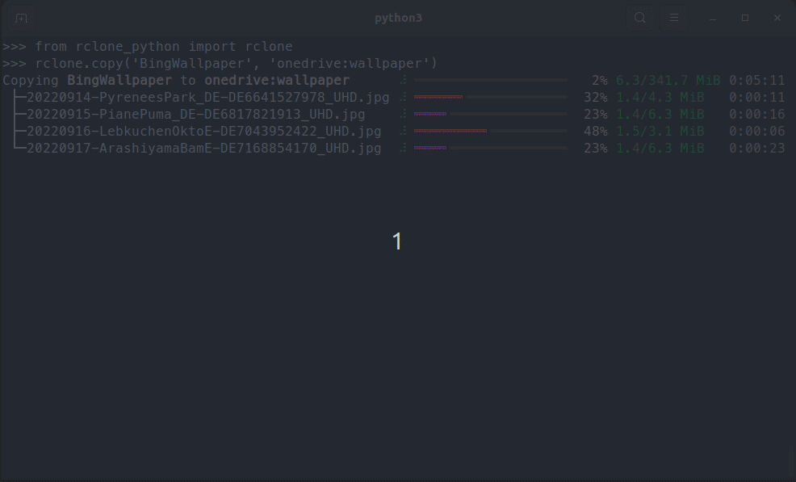

[](https://choosealicense.com/licenses/mit/)
[](https://badge.fury.io/py/rclone-python)

# rclone-python

A python wrapper for rclone that makes rclone's functionality usable in python.
rclone needs to be installed on the system for the wrapper to work.



## Features

- Copy and move files between remotes
- Delete and prune files/directories
- Create new remotes
- Check available remotes

## Demo

### Create new remote

Create a new rclone remote connection with rclone's default client-id and client-secret.

```python
from py_rclone import rclone
from py_rclone.remote_types import RemoteTypes

rclone.create_remote('onedrive', RemoteTypes.onedrive)
```

Additionally, client-id and client-secret can be used with many ckoud providers.

```python
from py_rclone import rclone
from py_rclone.remote_types import RemoteTypes

rclone.create_remote('onedrive', RemoteTypes.onedrive, client_id='YOUR_CLIENT_ID', client_secret='YOUR_CLIENT_SECRET')
```

### Copy

```python
from py_rclone import rclone

# copy all file in the test_dir on OneDrive to the local data folder.
rclone.copy('onedrive:test_dir', 'data')
```

Copying from onedrive:test_dir to data |████████████████████████████████████████| 100% in 18.0s (5.56%/s)

### Delete

Delete a file or a directory. When deleting a directory, only the files in the directory (and all it's subdirectories)
are deleted, but the folders remain.

```python
from py_rclone import rclone

# delete a specific file on onedrive
rclone.delete('onedrive:data/video1.mp4')

```

### Prune

```python
from py_rclone import rclone

# remove the entire test_dir folder (and all files contained in it and it's subdirectories) on onedrive
rclone.purge('onedrive:test_dir')
```

